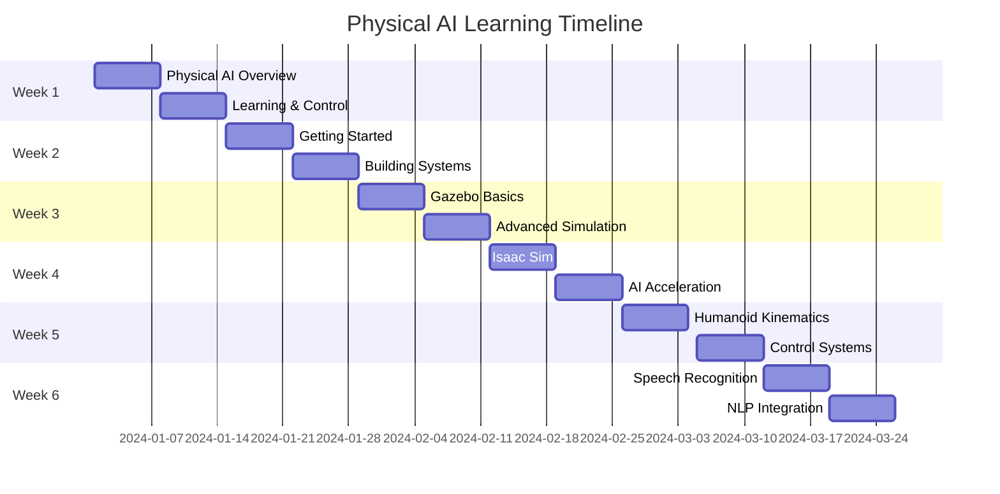

Welcome to your comprehensive guide to understanding intelligence as it emerges from physical systems. This book takes you on a journey through the intersection of artificial intelligence, robotics, and real-world physics.

---

## 🎯 What You'll Learn

This book is organized into **6 weeks** of focused learning, each building upon the last:

### 📘 Week 1 — Foundations
Explore the fundamental concepts of Physical AI, understanding how intelligence emerges through learning, control, and embodiment in physical systems.

### 📗 Week 2 — ROS 2 Fundamentals
Master the Robot Operating System 2, the backbone of modern robotics development with hands-on tutorials and practical applications.

### 📕 Week 3 — Robot Simulation
Learn to simulate complex robotic environments using Gazebo, enabling safe and efficient testing of AI-driven physical systems.

### 📙 Week 4 — NVIDIA Isaac Platform
Dive into advanced AI robotics with NVIDIA Isaac, leveraging powerful GPU acceleration for real-time perception and control.

### 📓 Week 5 — Humanoid Robots
Build and program humanoid robots, exploring kinematics, dynamics, and control systems for human-like intelligence.

### 📒 Week 6 — Conversational AI
Develop robots that engage in natural language, combining speech recognition, NLP, and physical embodiment.

---

## 🚀 Getting Started

### Prerequisites

Before diving in, ensure you have:

- **Knowledge**: Basic programming experience (Python preferred)
- **Math**: Understanding of linear algebra and calculus
- **Hardware**: A computer with at least 8GB RAM
- **OS**: Ubuntu 20.04+ (or WSL2 for Windows users)

### Installation

```bash
# Clone the repository
git clone https://github.com/your-username/physical-ai-learning.git

# Navigate to the directory
cd physical-ai-learning

# Install dependencies
pip install -r requirements.txt
```

### Your First Robot

```python
import rclpy
from rclpy.node import Node
from std_msgs.msg import String

class HelloWorldRobot(Node):
    def __init__(self):
        super().__init__('hello_world_robot')
        self.publisher_ = self.create_publisher(String, 'greeting', 10)
        self.timer = self.create_timer(1.0, self.publish_greeting)
        self.get_logger().info('Robot initialized!')

    def publish_greeting(self):
        msg = String()
        msg.data = 'Hello, Physical AI!'
        self.publisher_.publish(msg)
        self.get_logger().info(f'Published: {msg.data}')

def main():
    rclpy.init()
    robot = HelloWorldRobot()
    rclpy.spin(robot)
    robot.destroy_node()
    rclpy.shutdown()

if __name__ == '__main__':
    main()
```

---

## 📚 How to Use This Book

### Recommended Learning Path

1. **Sequential Study** - Follow the week-by-week structure for optimal learning
2. **Practical Application** - Complete each chapter's lab exercises
3. **Experimentation** - Don't just read—run the code and modify it
4. **Community** - Join discussions, ask questions, share your projects

### Chapter Structure

Each chapter includes:

- **Concept Overview** - Theoretical foundation
- **Code Examples** - Working implementations
- **Labs** - Hands-on exercises
- **Challenges** - Problems to solve
- **Further Reading** - Resources to deepen understanding

---

## 💡 Key Concepts

### What is Physical AI?

Physical AI represents the convergence of:

- **Machine Learning** - Algorithms that improve through experience
- **Control Theory** - Mathematical frameworks for dynamic systems
- **Embodiment** - Intelligence expressed through physical form

### Why This Matters

Traditional AI operates in the digital realm. Physical AI brings intelligence into the physical world, enabling robots to:

- Navigate complex environments
- Manipulate objects safely
- Adapt to unexpected situations
- Collaborate with humans naturally

---

## 🤝 Join the Community

Connect with fellow learners:

- 📧 **Email**: hello@physical-ai-learning.com
- 💬 **Discord**: [Join our server](https://discord.gg/physical-ai)
- 🐦 **Twitter**: [@PhysicalAILearn](https://twitter.com/PhysicalAILearn)
- 📹 **YouTube**: [Video Tutorials](https://youtube.com/@PhysicalAILearning)

---

## 📊 Project Progress



---

:::tip 💡 Pro Tip
Start with **Week 1** and build a strong foundation. Don't rush—each concept builds on the previous ones. Take time to experiment with the code examples and understand the underlying principles.
:::

---

## 🎓 Learning Objectives

By the end of this book, you will be able to:

1. ✅ Understand the theoretical foundations of Physical AI
2. ✅ Program robots using ROS 2
3. ✅ Simulate complex robotic systems
4. ✅ Leverage GPU acceleration with NVIDIA Isaac
5. ✅ Design humanoid robot control systems
6. ✅ Integrate conversational AI into robotics

---

Ready to begin? Let's dive into **[Week 1 — Foundations](week1/chapter1/introduction-to-physical-ai.md)**! 🚀
