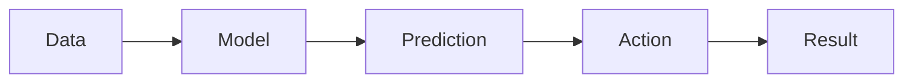
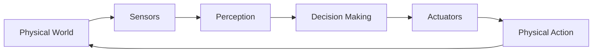

# Introduction to Physical AI

Welcome to Week 1, Chapter 1! This chapter lays the foundation for understanding intelligence as it emerges from physical systems.

## 🧠 What is Physical AI?

Physical AI represents the intersection of three fundamental domains:

| Domain | Description | Role in Physical AI |
|---------|-------------|----------------------|
| **Machine Learning** | Algorithms that improve through experience | Enables adaptation and learning |
| **Control Theory** | Mathematical frameworks for dynamic systems | Provides stability and precision |
| **Embodiment** | Intelligence expressed through physical form | Connects AI to real world |

---

## 🎯 Key Concept: Embodied Intelligence

Traditional AI operates in abstract digital spaces. Physical AI requires **embodiment**—intelligence that must interact with and adapt to the physical world.

### Why Embodiment Matters

:::info 💡 Key Insight
Embodiment isn't just adding a body to AI. It's a fundamental shift in how intelligence works. When an AI system is embodied:
- It receives sensory input directly from the world
- Its actions have physical consequences
- It must deal with uncertainty and noise
- Learning happens in real-time
:::

---

## 🤖 From Digital to Physical

### Traditional AI Pipeline



### Physical AI Pipeline



Notice the **feedback loop** in Physical AI—the robot's actions directly affect what it senses next.

---

## 💻 Code Example: Simple Embodied Agent

Let's create a basic embodied agent that learns to navigate toward a light source:

```python
import numpy as np

class LightSeekingAgent:
    """
    A simple embodied agent that learns to approach light sources.
    This demonstrates the core Physical AI concept of closed-loop sensing
    and acting.
    """

    def __init__(self, x=0, y=0):
        self.position = np.array([x, y], dtype=float)
        self.velocity = np.array([0.0, 0.0])
        self.light_sensors = [0.0, 0.0, 0.0]  # Left, center, right
        self.learning_rate = 0.1

        # Neural network weights (simple: sensor inputs -> motor outputs)
        self.weights = np.random.randn(3, 2) * 0.1

    def sense(self, light_sources):
        """Detect light intensity from multiple sensors."""
        for i in range(3):
            sensor_angle = (i - 1) * np.pi / 6  # -30°, 0°, +30°
            sensor_direction = np.array([
                np.cos(sensor_angle),
                np.sin(sensor_angle)
            ])

            total_light = 0
            for light_pos, intensity in light_sources:
                to_light = light_pos - self.position
                distance = np.linalg.norm(to_light)
                direction = to_light / (distance + 0.1)

                # Sensor response based on alignment with light direction
                response = np.dot(sensor_direction, direction) * intensity / (distance + 1)
                total_light += response

            self.light_sensors[i] = np.maximum(0, total_light)

    def think(self):
        """Process sensor input to decide motor output."""
        # Simple neural network: sensors -> motor outputs
        sensor_input = np.array(self.light_sensors)
        motor_output = np.dot(sensor_input, self.weights)

        # Apply activation function
        motor_output = np.tanh(motor_output)
        return motor_output

    def act(self, motor_output):
        """Execute motor commands."""
        # Update velocity based on motor output
        self.velocity += motor_output * 0.1
        self.velocity = np.clip(self.velocity, -0.5, 0.5)

        # Update position
        self.position += self.velocity

    def learn(self, reward):
        """Learn from experience (simple reinforcement learning)."""
        sensor_input = np.array(self.light_sensors)
        motor_output = self.think()

        # Update weights based on reward
        error = reward * motor_output
        weight_update = self.learning_rate * np.outer(sensor_input, error)
        self.weights += weight_update

    def step(self, light_sources):
        """Execute one complete sensing-thinking-acting cycle."""
        # Sense the environment
        self.sense(light_sources)

        # Think and decide on action
        motor_output = self.think()

        # Act on decision
        self.act(motor_output)

        # Calculate reward (closer to light = higher reward)
        max_light = max(self.light_sensors)
        reward = max_light / 10.0

        # Learn from experience
        self.learn(reward)

        return reward, self.position.copy()

# Simulation
agent = LightSeekingAgent(x=0, y=0)
light_sources = [
    (np.array([5.0, 5.0]), 10.0),  # Light at (5, 5) with intensity 10
    (np.array([10.0, -5.0]), 8.0),  # Light at (10, -5) with intensity 8
]

print("Training light-seeking agent...")
for step in range(100):
    reward, position = agent.step(light_sources)
    if step % 10 == 0:
        print(f"Step {step}: Position = {position:.2f}, Reward = {reward:.3f}")
```

---

## 🎮 Lab Exercise 1: Light Following

### Objective
Implement a light-following robot simulation that navigates toward multiple light sources.

### Requirements

1. Create a `Robot` class with:
   - Position (x, y) and orientation (θ)
   - Two light sensors positioned at ±45° from heading
   - Motor controls for linear and angular velocity

2. Implement a control algorithm:
   - If left sensor brighter → turn left
   - If right sensor brighter → turn right
   - If both equal → move forward

3. Add learning capability:
   - Robot should improve over multiple runs
   - Track performance metrics (time to reach light)

### Template

```python
# TODO: Fill in the implementation

class LightFollowingRobot:
    def __init__(self):
        self.x = 0
        self.y = 0
        self.theta = 0  # Orientation in radians
        # TODO: Initialize sensors and state

    def sense(self, light_pos, light_intensity):
        # TODO: Calculate light intensity at sensor positions
        pass

    def control(self):
        # TODO: Implement control logic
        pass

    def act(self, linear_vel, angular_vel):
        # TODO: Update robot position based on velocities
        pass

    def simulate_step(self, light_sources):
        # TODO: Execute one complete step
        pass
```

---

## 🧪 Challenge: Multiple Light Sources

When faced with two light sources of equal intensity, how should the robot behave?

1. **Approach the nearest**
2. **Approach the brightest**
3. **Approach both (oscillate between them)**
4. **Choose randomly**

Think about how real biological organisms handle this situation.

:::warning 🤔 Consider
What would a moth do when presented with two equally bright lights? This isn't just an engineering problem—it's a biological one too!
:::

---

## 📚 Further Reading

1. **"Embodied Artificial Intelligence"** - Pfeifer & Scheier (2001)
   - Foundational paper on why embodiment matters for intelligence

2. **"Behavior-Based Robotics"** - Rodney Brooks (1986)
   - Classic paper on building robots without explicit world models

3. **"The Embodied Mind"** - Shaun Gallagher (2005)
   - Philosophical perspective on embodied cognition

---

## ✅ Check Your Understanding

### Questions

1. What are the three core domains that Physical AI combines?

2. Why is embodiment considered a fundamental shift from traditional AI?

3. In the LightSeekingAgent example, what represents the "reward" signal?

4. How does the feedback loop in Physical AI differ from traditional AI pipelines?

5. What would happen if the light sensors in our example had no noise at all?

### Answers

<details>
<summary>Click to reveal answers</summary>

1. Machine Learning, Control Theory, and Embodiment

2. Embodiment means the AI system must interact directly with the physical world, receive sensory input, and produce actions with real consequences—creating a closed feedback loop that traditional AI lacks.

3. The reward is the maximum light intensity detected by the sensors, representing how close/well-aligned the agent is with a light source.

4. Physical AI creates a closed feedback loop where actions affect the environment, which then affects future sensory input. Traditional AI typically has no such direct feedback.

5. Without any sensor noise, the robot might behave too perfectly and potentially get stuck in local optima. Real sensors always have some noise, which actually helps exploration and learning.

</details>

---

## 🚀 Next Up

In the next chapter, we'll dive deeper into **[What is Intelligence?](what-is-intelligence.md)** to understand the theoretical foundations of what we're trying to create.

:::tip 📝 Navigation
Use the sidebar to navigate through chapters. Each section builds upon the previous, so complete exercises before moving on!
:::
