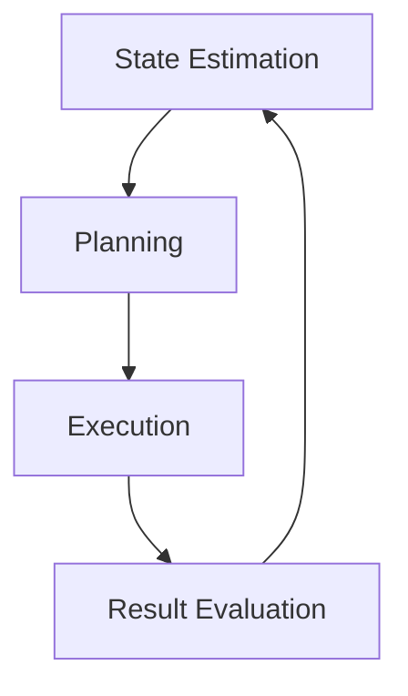

# What is Intelligence?

Exploring the fundamental question: What does it mean for an AI system to be intelligent?

## 🧩 Types of Intelligence

| Type | Description | Example in Physical AI |
|--------|-------------|---------------------|
| **Perceptual Intelligence** | Understanding sensory information | Object recognition, scene understanding |
| **Motor Intelligence** | Controlling physical actions | Walking, grasping, manipulation |
| **Cognitive Intelligence** | Reasoning and planning | Path planning, decision making |
| **Social Intelligence** | Interacting with others | Collaboration, communication |

## 🔬 The Intelligence Spectrum

```mermaid
graph LR
    A[Reflexive] --> B[Reactive]
    B --> C[Deliberative]
    C --> D[Meta-Cognitive]

    A --> |Instinctive responses|
    B --> |Situation-action mappings|
    C --> |Planning & reasoning|
    D --> |Learning & adaptation|
```

### Reflexive Intelligence

The simplest form of intelligence - automatic responses to specific stimuli.

**Examples:**
- Thermostat turning on/off based on temperature
- Robot's emergency stop when detecting obstacle
- Hand pulling away from hot surface

:::info Biological Inspiration
Reflexes are incredibly fast (100-200ms) but inflexible. They're great for survival but limited for complex tasks.
:::

### Reactive Intelligence

Uses sensors to map directly to actions without internal models.

**Examples:**
- Braitenberg vehicles that follow light sources
- Simple obstacle avoidance behaviors
- Taxis movements (approaching/avoiding stimuli)

```python
# Simple reactive behavior - follow light
class ReactiveRobot:
    def __init__(self):
        self.light_sensor = 0
        self.motor_output = 0

    def sense(self, light_intensity):
        """Direct sensor-to-motor mapping"""
        # More light = move forward faster
        self.motor_output = min(light_intensity, 1.0)

    def act(self):
        """Execute motor command"""
        # Direct control - no deliberation
        return self.motor_output
```

### Deliberative Intelligence

Maintains internal models of the world and plans actions.

**Examples:**
- Path planning in known environments
- Task scheduling for complex missions
- Navigation with maps



### Meta-Cognitive Intelligence

Learns about how to learn - intelligence about intelligence.

**Key capabilities:**
1. **Self-Modeling** - Understanding own capabilities and limitations
2. **Theory of Mind** - Modeling others' mental states
3. **Meta-Learning** - Choosing how to learn from experience

:::warning 💡 Critical Distinction
Meta-cognition is what separates "simple AI" from "general AI". A system that can optimize its own learning approach is significantly more powerful.
:::

## 📊 Measuring Intelligence

Multiple ways to measure intelligence in physical systems:

### 1. Task-Based Metrics

- Success rate on specific tasks
- Time to complete tasks
- Energy efficiency
- Robustness to variations

### 2. Generalization Metrics

- Performance on unseen tasks
- Transfer learning effectiveness
- Adaptation speed to new environments

### 3. Complexity Metrics

- Types of problems solvable
- Maximum problem size
- Computation time required

## 🤖 Intelligence Embodied

**Key insight:** Intelligence depends on embodiment!

### Sensor-Actuator Coupling

The physical form of a robot determines:
- What it can sense
- How it can act
- What it can learn

```python
# Different embodiments → different intelligences
class EmbodiedIntelligence:
    def __init__(self, embodiment):
        self.embodiment = embodiment
        if embodiment == 'wheeled':
            self.sensors = ['wheel_odometry', 'lidar']
            self.actuators = ['wheel_drive', 'steering']
        elif embodiment == 'legged':
            self.sensors = ['joint_encoders', 'imu', 'vision']
            self.actuators = ['joint_torque', 'balance']
        elif embodiment == 'manipulator':
            self.sensors = ['camera', 'force_sensors']
            self.actuators = ['gripper', 'arm_joints']
```

### Constraints Shape Intelligence

Physical constraints create intelligence:
- **Spatial constraints** - Can't be everywhere at once
- **Energy constraints** - Must act efficiently
- **Temporal constraints** - Must act in real-time
- **Material constraints** - Limited by what body can do

:::tip 💡 Embodiment Hypothesis
Intelligence emerges from the interaction between an embodied agent and its environment. The body isn't just a container - it's an integral part of the cognitive system.
:::

## 🎯 Chapter Summary

In this chapter we explored:

1. ✅ Different types of intelligence (perceptual, motor, cognitive, social)
2. ✅ The intelligence spectrum from reflexive to meta-cognitive
3. ✅ How to measure intelligence with multiple metrics
4. ✅ The crucial role of embodiment in shaping intelligence

## 🧪 Challenge: Designing Intelligence

**Task:** Design a robot with appropriate intelligence type for these scenarios:

1. **Emergency stop system** - What type of intelligence is most appropriate?
2. **Home assistant** - Which type(s) would work best?
3. **Search and rescue** - What level of intelligence is needed?

Consider:
- Required response time
- Environmental uncertainty
- Task complexity
- Safety requirements

---

:::info Next Chapter
In the next chapter, we'll explore **[Embodiment in AI](embodiment-in-ai.md)** - how physical form fundamentally shapes what intelligence can be.
:::
